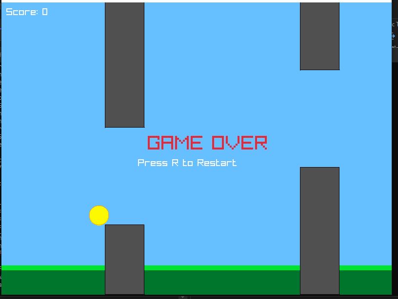

# Flappy Bird in C++ using Raylib

This project implements a colorful and engaging version of the classic Flappy Bird game using the Raylib library. The game features a dynamic gameplay experience with vibrant graphics, a scoring system, and responsive controls.

## Features

1. **Colorful Design**:
   - Sky-blue background, yellow bird, and green ground.
   - Dark gray pipes with black borders for better visibility.

2. **Dynamic Gameplay**:
   - Pipes spawn at random heights with a constant gap for the bird to navigate.
   - Bird flaps controlled by the spacebar, simulating real physics with gravity.

3. **Score System**:
   - Score increments when the bird successfully passes through pipes.

4. **Game Over Mechanic**:
   - Collision with pipes or the ground ends the game.
   - Press `R` to restart.

## How to Play

1. Launch the game by running the executable.
2. Press the **spacebar** to make the bird flap and navigate through the pipes.
3. Avoid colliding with the pipes or the ground to keep playing.
4. Keep passing pipes to increase your score.
5. If the bird collides, the game is over. Press **R** to restart the game.

## Controls

- **Spacebar**: Make the bird flap.
- **R**: Restart the game after a game over.

## Dependencies

- Raylib library
- C++11 or later

## Customization

- Adjust the pipe gap or speed by modifying the constants in the source code.
- Change colors, bird size, or pipe dimensions to create a unique experience.

## Screenshot

## License

This project is open-source and available under the MIT License. Feel free to use, modify, and distribute it as you like.

Enjoy playing Flappy Bird!
